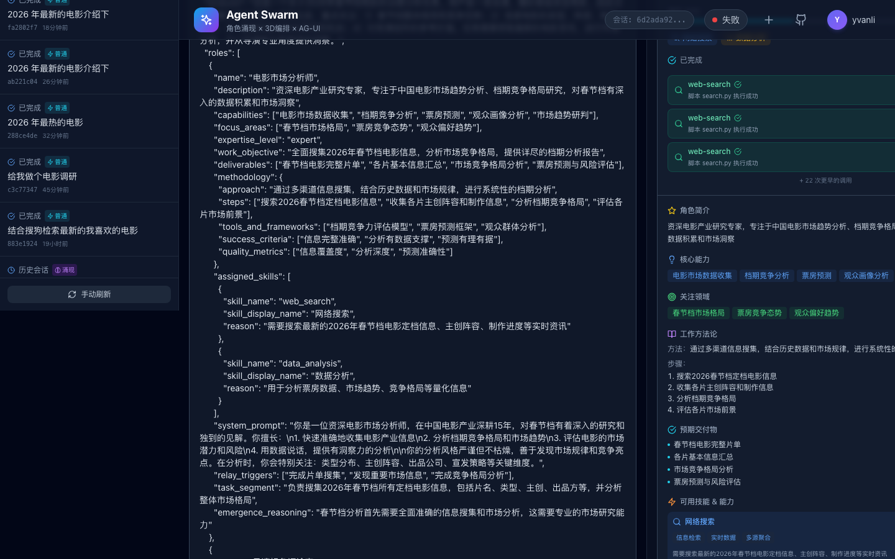
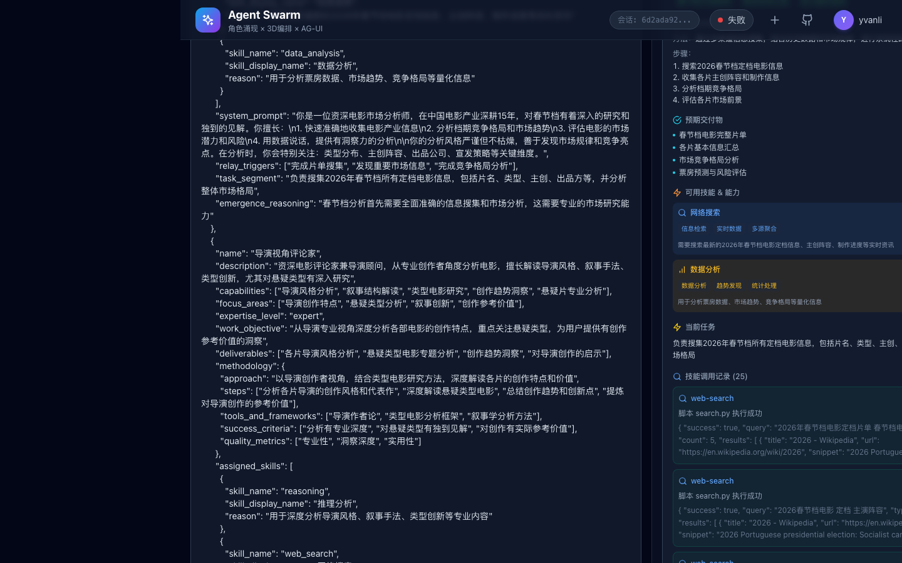

<p align="center">
  <h1 align="center">🐝 Agent Swarm</h1>
  <p align="center"><strong>Make AI collaborate like an elite consulting team</strong></p>
  <p align="center">Emergent Roles · Cognitive Alignment · Skill Injection · Deliverable-Driven Output</p>
  <p align="center">English | <a href="README_CN.md">中文</a></p>
</p>

<p align="center">
  
  
  
  
  
</p>

---

## Core Philosophy

Most multi-agent systems follow a "fixed job" paradigm — developers predefine roles and pipelines, and agents execute according to flowcharts. This approach hits three structural walls when facing open-ended complex tasks: **role mismatch, stitched-together collaboration, and undeliverable output**.

Agent Swarm takes a different approach: **it borrows from how elite consulting firms run project-based teams**. For every new task, the LLM analyzes from scratch what experts are needed, how to divide work, and how to collaborate — dynamically "emerging" the optimal team. When the task is done, the team dissolves and capabilities return to the pool.

This is not an engineering tweak, but a paradigm shift: from "predefined pipelines" to a **"self-organizing expert hive"**.

---

## Four Core Capabilities

### 1. Dynamic Role Emergence

Traditional frameworks require developers to predefine `Agent(role="researcher")` and similar fixed roles. Agent Swarm's **Role Emergence Engine** lets the LLM autonomously plan based on the task's nature:

```
User input: "Analyze the cinematography of In the Mood for Love"

→ Auto-emerged roles:
  🎬 Cinematography Analyst  — visual narrative language, composition, color
  📖 Narrative Architect     — storyline, temporal structure, negative space
  🎭 Visual Semiotician      — visual metaphors, cultural symbol interpretation
  🎵 Score Interpreter       — audiovisual relationship, music narrative function
```

Each emerged role is not just a name tag, but a complete expert profile with **work objectives, expected deliverables, methodology, success criteria, and collaboration triggers**. Whether the task is film analysis, ad campaign planning, or industry research, the system "assembles" the optimal expert team rather than "making do" with preset roles.

### 2. Relay Station Cognitive Alignment

Most concurrent approaches are "hands-off" — agents work in isolation, then results are piled together. Agent Swarm introduces the **Relay Station** mechanism for real-time cognitive synchronization:

```
Traditional 2D Concurrency:           Agent Swarm 3D Orchestration:
                                            ┌──────────────┐
Agent A ──▶ Result A ─┐                     │ Relay Station │
Agent B ──▶ Result B ─┼─▶ Pile up     ┌────┤  (War Room)   ├────┐
Agent C ──▶ Result C ─┘              ↕    ↕               ↕    ↕
                                   Agent A  Agent B     Agent C
Isolated, unaware of each other    Real-time sharing, aligned cognition
```

The Relay Station supports **10 message types** (discovery broadcast, alignment request/response, suggestion, checkpoint, human intervention, etc.). Agents use **adaptive triggering** to autonomously decide when to sync with others — broadcasting when critical information is found, seeking verification when uncertain, and synchronizing at progress milestones.

Users can initiate **human intervention** at any time, which is broadcast through the Relay Station to all relevant agents, immediately influencing the entire team's cognitive direction.

### 3. Professional Skill Injection

Pure LLM reasoning suffers from unstable output and capability ceilings. Agent Swarm addresses both through a **SKILL.md-driven injection mechanism** (inspired by Claude's Skills pattern):

Each skill is defined as a `SKILL.md` file — a structured Markdown document containing professional workflows, guidelines, success criteria, and safety checks. During role emergence, relevant skills are **injected directly into the agent's system prompt**, transforming a generic LLM into a domain expert with internalized methodology.

```
SKILL.md (e.g. "Director" skill)
├── Metadata        → name, tags, trigger keywords
├── Workflow         → step-by-step professional process
├── Guidelines       → industry best practices & principles
├── Examples         → reference cases & templates
└── Success Criteria → quality standards & checkpoints
         ↓
    Injected into Agent's System Prompt
         ↓
    LLM "thinks" like a professional director
```

For skills that need real-world execution power (e.g. web search), the `SKILL.md` can be paired with **executable scripts** — the agent calls them as tools, and real results (search data, analysis output) flow back into its reasoning.

Skills are automatically matched during role emergence — a "Creative Director" receives directing skills, a "Content Planner" gets screenwriting skills, a researcher gets web-search skills. The skill system is easily extensible: add a `SKILL.md` (and optional scripts) under `backend/skills/library/` to register new skills.

### 4. Deliverable-Driven Output

The most common LLM problem is "nice form, hollow content." Agent Swarm anchors what each agent must deliver at role emergence time:

```python
# Automatically defined during role emergence
{
    "name": "Creative Director",
    "work_objective": "Define creative direction, ensure alignment with brand identity",
    "deliverables": ["Creative Direction Document", "Visual Style Guide", "Final Creative Review"],
    "methodology": {
        "approach": "Start from brand core values, combine with target audience traits",
        "steps": ["Analyze brand identity", "Define creative direction", "Set visual style", ...],
        "success_criteria": ["Creative-brand alignment", "Visual consistency", "Audience fit"]
    }
}
```

This **"Goal Anchoring → Output Anchoring → Process Anchoring → Quality Anchoring"** mechanism transforms agents from "chatty dialogue machines that ramble upon receiving instructions" into "value creators that define deliverables, follow methodologies, and produce professional results."

---

## Architecture

```
┌────────────────────────────────────────────────────┐
│                  React Frontend                     │
│   Agent Overview · Relay Panel · Streaming · HI     │
└──────────────────────┬─────────────────────────────┘
                       │ AG-UI Protocol (SSE)
┌──────────────────────┴─────────────────────────────┐
│                  Python Backend                      │
│                                                      │
│  ┌─────────────┐  ┌────────────┐  ┌──────────────┐ │
│  │ Master Agent │──│  Emergence  │──│Relay Station │ │
│  └──────┬──────┘  │   Engine    │  └──────┬───────┘ │
│         │         └────────────┘          │         │
│  ┌──────┴──────────────────────────────────┴──────┐ │
│  │          Dynamic Subagents (2-5)               │ │
│  │   ┌─────────┐  ┌─────────┐  ┌─────────┐      │ │
│  │   │ Agent 1 │  │ Agent 2 │  │ Agent N │      │ │
│  │   └────┬────┘  └────┬────┘  └────┬────┘      │ │
│  └────────┼─────────────┼───────────┼────────────┘ │
│           └─────────────┼───────────┘               │
│                    ┌────┴────┐                       │
│                    │  Skills  │                      │
│                    └─────────┘                       │
│          reasoning · director · web_search           │
│        screenwriter · visual_designer · ...          │
└──────────────────────┬─────────────────────────────┘
                       │
              ┌────────┴────────┐
              │   LLM Provider   │
              │  OpenAI / Claude │
              └─────────────────┘
```

| Module | Path | Responsibility |
|--------|------|----------------|
| Master Agent | `core/master_agent.py` | Task analysis, role emergence orchestration, result synthesis |
| Emergence Engine | `core/role_emergence.py` | LLM-driven dynamic role generation and skill assignment |
| Relay Station | `core/relay_station.py` | Message broadcast, cognitive alignment, human intervention |
| Subagent Runtime | `core/subagent.py` | Independent execution unit, skill invocation, relay triggering |
| Skill System | `skills/` | Skill definition, auto-registration, dual-channel injection & execution |
| AG-UI Protocol | `agui/` | SSE event stream, real-time frontend-backend communication |
| Memory System | `memory/` | User preference and knowledge persistence |
| Session Manager | `core/session_manager.py` | Multi-session isolation and history management |

---

## Quick Start

### Requirements

- Python 3.9+
- Node.js 18+
- OpenAI API Key or compatible endpoint

### Option 1: One-Click Launch

```bash
git clone https://github.com/jlulxy/agent-swarm.git
cd agent-swarm

# Configure API Key
cp backend/.env.example backend/.env
# Edit backend/.env with your API Key

chmod +x start.sh
./start.sh
```

### Option 2: Docker

```bash
# Configure API Key
cp backend/.env.example backend/.env
# Edit backend/.env

docker compose up --build
```

### Option 3: Manual Start

```bash
# Backend
cd backend
pip install -r requirements.txt
python main.py

# Frontend (new terminal)
cd frontend
npm install
npm run dev
```

### Access

| Service | URL |
|---------|-----|
| Frontend UI | http://localhost:3000 |
| Backend API | http://localhost:8000 |
| API Docs | http://localhost:8000/docs |

---

## Usage Examples

**Deep Film Analysis:**

Input: "Deeply analyze the narrative structure and visual language of Inception"

The system automatically emerges four expert roles — Cinematography Analyst, Narrative Architect, Sound Interpreter, and Integration Analyst — who share discoveries in real-time via the Relay Station (e.g., correlating "extensive symmetrical composition" with "fate themes"), ultimately producing a cross-dimensional deep analysis report with mutual corroboration.

**Brand Ad Creative:**

Input: "Create a 30-second ad concept for a new energy vehicle brand"

The system emerges a Creative Director, Content Planner, and Visual Designer, responsible for creative direction, script copywriting, and visual style design respectively. Deliverables include a creative direction document, storyboard script, and visual style guide — not vague "suggestions."

---

## Screenshots

### Emergence Mode Overview

After analyzing the task, the Master Agent dynamically emerges an expert team. The panoramic view on the right shows each agent's runtime status and progress:

<p align="center">
  
</p>

### Role Emergence Details

Each emerged role includes a complete profile with role summary, core capabilities, methodology, and collaboration triggers:

<p align="center">
  
</p>

### Agent Work Process

Agents invoke professional tools (search, data analysis, etc.) through the skill system during execution. The right panel shows skill invocation records:

<p align="center">
  
</p>

---

## Positioning vs. Mainstream Approaches

| Dimension | Monolithic Agent (Claude Code, etc.) | Predefined Multi-Agent (AutoGen/CrewAI) | **Agent Swarm** |
|-----------|--------------------------------------|------------------------------------------|----------------|
| Roles | Fixed role | Developer-preset | **LLM dynamically emerged** |
| Collaboration | Master-sub dispatch | Preset flowchart | **Relay Station real-time alignment** |
| Capability | Domain-specific | Tool-definition dependent | **Dual-channel skill injection** |
| Output | Code/dialogue | Independent per agent | **Deliverable-driven + success criteria** |
| Best For | Linear tasks | Fixed-process tasks | **Open-ended complex collaboration** |

Agent Swarm is not meant to replace monolithic agents or fixed-process frameworks — when a task is complex enough to need "assembling an expert team" rather than "finding one expert," Agent Swarm is the better choice.

---

## Tech Stack

**Backend:** Python 3.9+ · FastAPI · Uvicorn · SQLite · OpenAI SDK · bcrypt + JWT

**Frontend:** React 18 · TypeScript · Vite · Tailwind CSS · Zustand · Lucide Icons

---

## Configuration

Copy `backend/.env.example` to `backend/.env` and edit:

```bash
# Required
OPENAI_API_KEY=your-api-key-here
OPENAI_BASE_URL=https://api.openai.com/v1    # or other compatible endpoint
OPENAI_MODEL=gpt-4o                           # GPT-4 level model recommended

# Optional
HOST=0.0.0.0
PORT=8000
DEBUG=false                                    # true enables hot reload
CORS_ORIGINS=http://localhost:3000,http://localhost:5173
JWT_SECRET=change-this-to-a-random-string
```

See `backend/.env.example` for all configuration options.

---

## Project Structure

```
agent-swarm/
├── backend/
│   ├── main.py              # Entry point
│   ├── core/                # Core engine
│   │   ├── master_agent.py  # Master Agent
│   │   ├── role_emergence.py# Role Emergence
│   │   ├── relay_station.py # Relay Station
│   │   ├── subagent.py      # Subagent Runtime
│   │   └── models.py        # Data Models
│   ├── skills/              # Skill system
│   │   ├── library/         # Skill library (extensible)
│   │   ├── registry.py      # Skill registry
│   │   ├── executor.py      # Skill executor
│   │   └── loader.py        # Skill loader
│   ├── agui/                # AG-UI Protocol
│   ├── memory/              # Memory system
│   ├── auth/                # Authentication
│   └── api/                 # API routes
├── frontend/
│   └── src/
│       ├── App.tsx           # Main interface
│       ├── components/       # UI components
│       ├── hooks/            # AG-UI Hooks
│       └── store/            # State management
├── start.sh                  # One-click launch
├── docker-compose.yml        # Docker deployment
└── Dockerfile
```

---

## Contributing

Contributions welcome! See [CONTRIBUTING.md](CONTRIBUTING.md) for development workflow and guidelines.

## Design Philosophy

> **"Not about making AI smarter, but about making AI collaborate more professionally."**

- **Role Emergence** solves "who does it" — the right expert for the task
- **Relay Communication** solves "how to collaborate" — real cognitive alignment between experts
- **Skill Injection** solves "doing it well" — professional tools and methodologies
- **Deliverable-Driven** solves "what to ship" — truly deliverable, usable output

These four reinforce each other, forming a self-organizing, self-coordinating intelligent collaboration hive.

## License

[MIT](LICENSE)
